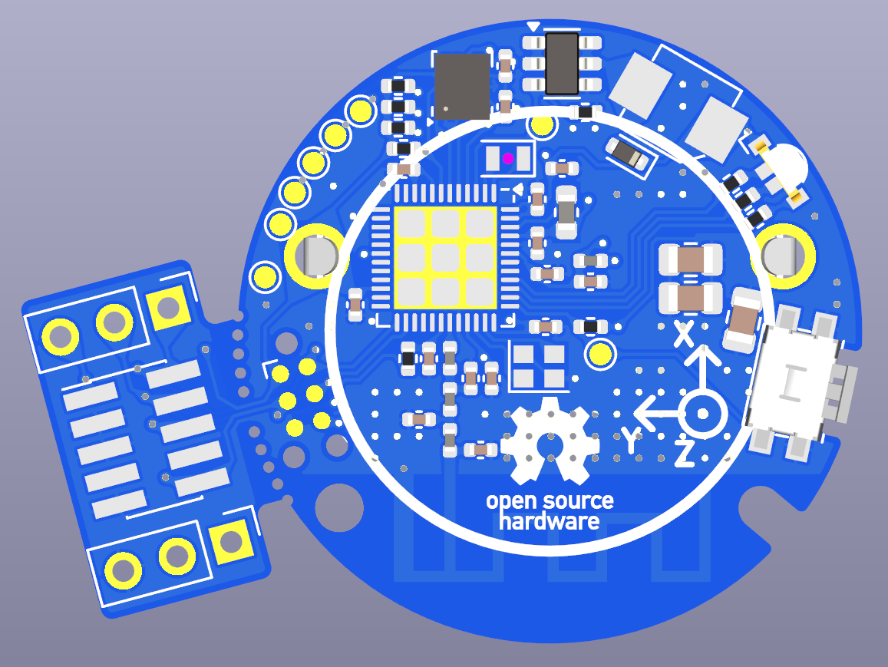

# two-quid-hw
Miniature nRF54L-based board with IMU/RGB LED/button/buzzer/2032 battery

## Features
- Nordic nRF54L15 wireless SoC
- ST LSM6DSL 6DoF IMU
- RGB LED indicator
- Push-button
- 4kHz buzzer
- Powered by replaceable 2032 coin cell battery
- £2 coin-sized PCB(D=28.4mm)
- ~6.5mm overall PCBA height
- Sane 0402 components
- Breakaway piece with debugging connectors: \
    10-pin [Cortex-Debug](https://developer.arm.com/documentation/101416/0100/Hardware-Description/Target-Interfaces/Cortex-Debug--10-pin-) (1.27mm pitch) connector for debugging using nRF54L15-DK+[IDC cable](https://www.adafruit.com/product/1675) or J-Link+[ARM-JTAG-20-10 cable](https://www.olimex.com/Products/ARM/JTAG/ARM-JTAG-20-10/) \
    2x3-pin (2.54mm pitch) connectors for jumper wires
